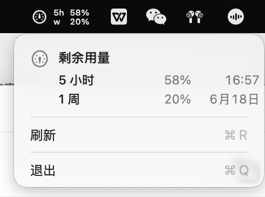

# Codex Usage Mac Menubar

一个 macOS 菜单栏应用，用来随时查看本机 Codex 的剩余额度。

状态栏显示两行剩余用量：

- `5h`：5 小时滚动窗口的剩余额度
- `w`：周额度的剩余额度

它只读取本机 Codex 会话日志，不调用 OpenAI API，也不读取
`~/.codex/auth.json`。



## 功能

- 在 macOS 状态栏显示 Codex 5 小时额度和周额度
- 点击后显示剩余额度、刷新时间和刷新按钮
- 登录 macOS 后自动启动
- 本地解析日志，不发起网络请求
- 启动时使用本地缓存先显示上次结果，再后台刷新
- 本地日志写入后通常 10 秒内更新状态栏

## 系统要求

- macOS 13 或更高版本
- 本机已使用过 Codex，并且存在 `~/.codex/sessions` 会话日志

只有从源码构建时才需要 Xcode Command Line Tools。

## 下载方式（推荐）

### 方式一：下载 app 压缩包

打开 [Releases](https://github.com/peb44043399-web/codex-usage-mac-menubar/releases/latest)，下载：

```text
CodexUsageMacMenubar.app.zip
```

解压后可以直接运行 app。首次运行时，如果 macOS 提示来自未认证开发者，需要在
“系统设置 -> 隐私与安全性”里允许打开，或右键 app 后选择“打开”。

这种方式只负责运行 app；如果需要登录后自动启动，使用下面的一行安装方式。

### 方式二：一行安装并配置开机启动

这条命令会下载最新 Release，把 app 安装到 `~/Applications`，生成 LaunchAgent，
并立即启动菜单栏应用：

```zsh
curl -fsSL https://raw.githubusercontent.com/peb44043399-web/codex-usage-mac-menubar/main/scripts/install-release.sh | zsh
```

如果要先查看脚本内容，打开：

```text
https://raw.githubusercontent.com/peb44043399-web/codex-usage-mac-menubar/main/scripts/install-release.sh
```

卸载一行安装版本：

```zsh
curl -fsSL https://raw.githubusercontent.com/peb44043399-web/codex-usage-mac-menubar/main/scripts/uninstall-release.sh | zsh
```

## 从源码构建

源码构建需要 Xcode Command Line Tools，用于提供 `swiftc`。

如果没有 `swiftc`，先安装 Xcode Command Line Tools：

```zsh
xcode-select --install
```

克隆仓库、构建应用，然后安装为 LaunchAgent：

```zsh
git clone https://github.com/peb44043399-web/codex-usage-mac-menubar.git
cd codex-usage-mac-menubar
scripts/build.sh
scripts/install-launch-agent.sh
```

安装后应用会立即启动，并在下次登录 macOS 时自动启动。

注意：LaunchAgent 会指向当前仓库目录里的 app。如果安装后移动或删除这个
仓库目录，开机启动会失效。需要移动目录时，请先卸载，再从新位置重新安装。

## 使用说明

菜单栏会显示两行：

```text
5h 68%
w  21%
```

这两个百分比都是剩余额度，不是已用额度。

状态栏数据来自本机 Codex session 日志，不是直接查询 Codex 服务端。因此它会跟随
本地 `rate_limits` 事件更新：Codex 页面可能先显示新额度，日志写入后菜单栏才会
更新。后台会每 10 秒刷新一次，也可以在菜单里手动点击“刷新”。

点击菜单栏图标后会打开详情菜单，里面显示：

- 5 小时剩余额度和刷新时间
- 周剩余额度和刷新日期
- 手动刷新
- 退出

按住 Option 再打开菜单，可以显示源日志入口，用于排查当前额度来自哪个日志文件。

## 不安装时测试解析结果

先构建：

```zsh
scripts/build.sh
```

然后运行一次解析：

```zsh
dist/CodexQuotaMenu.app/Contents/MacOS/CodexQuotaMenu --print-once
```

示例输出：

```text
Codex 5h 68% w 21%
5小时剩余用量: 68%
5h刷新时间: 2026/6/16, 16:57:00
周剩余用量: 21%
weekly刷新时间: 2026/6/18, 10:43:30
```

## 安装、重启、卸载

这一节适用于从源码构建后安装的场景。

安装或重启 LaunchAgent：

```zsh
scripts/install-launch-agent.sh
```

卸载：

```zsh
scripts/uninstall-launch-agent.sh
```

检查 LaunchAgent 是否正在运行：

```zsh
launchctl print "gui/$(id -u)/com.local.codex-quota-menubar"
```

查看错误日志：

```zsh
tail -n 80 /tmp/codex-quota-menubar.err.log
```

## 配置

应用读取以下环境变量：

| 变量 | 默认值 | 含义 |
| --- | --- | --- |
| `CODEX_HOME` | `~/.codex` | Codex 主目录 |
| `CODEX_LIMIT_ID` | `codex` | 优先读取的 rate-limit id |
| `CODEX_QUOTA_LOOKBACK_DAYS` | `3` | 优先扫描最近几天的 session 日志 |

安装脚本会把 `CODEX_HOME` 和 `CODEX_LIMIT_ID` 写入生成的 LaunchAgent plist。
如果要修改这些值，请编辑 `scripts/install-launch-agent.sh`，然后重新运行安装脚本。

## 工作原理

应用会扫描以下本地 JSONL 文件：

```text
~/.codex/sessions
~/.codex/archived_sessions
```

它会寻找最新的 `rate_limits` 事件，提取 5 小时窗口和周窗口，然后把剩余百分比
渲染到 macOS 状态栏。

为了提升启动速度，应用会缓存上一次解析到的额度快照：

```text
~/Library/Caches/local.codex.quota-menubar/last-snapshot.json
```

这个缓存只包含最近一次额度快照，不包含 Codex 凭据。

## 常见问题

### 状态栏显示 `--`

这通常表示本地日志里还没有找到 `rate_limits` 事件。先使用一次 Codex，或在
Codex 会话里查看状态，然后点击菜单里的刷新。

### 登录后没有自动启动

重新安装 LaunchAgent 并检查状态：

```zsh
scripts/install-launch-agent.sh
launchctl print "gui/$(id -u)/com.local.codex-quota-menubar"
```

### 移动仓库目录后无法启动

LaunchAgent 记录的是安装时的 app 路径。移动目录后需要重新安装：

```zsh
scripts/uninstall-launch-agent.sh
scripts/install-launch-agent.sh
```

### 构建时报 `swiftc: command not found`

安装 Xcode Command Line Tools：

```zsh
xcode-select --install
```

## 隐私

这个应用只在本机工作：

- 不发起网络请求
- 不调用 OpenAI API
- 不读取 `~/.codex/auth.json`
- 不做遥测

它只读取本机 Codex session JSONL 文件中的额度元数据。

## 许可证

MIT
